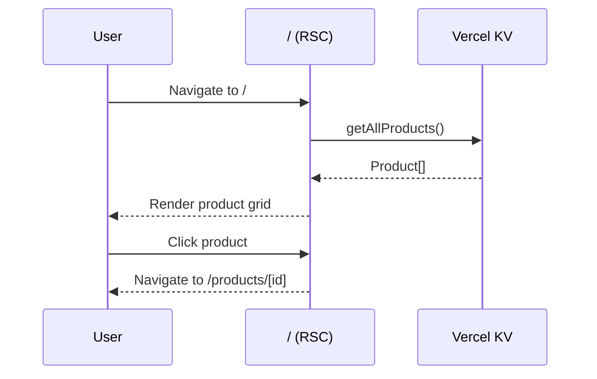
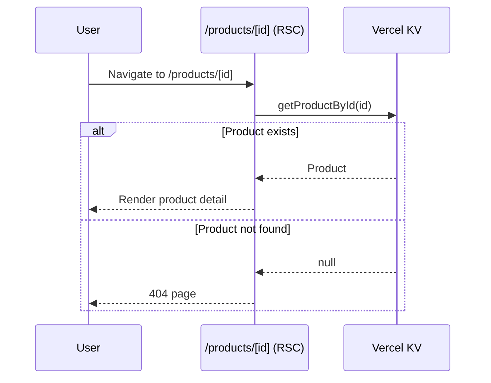
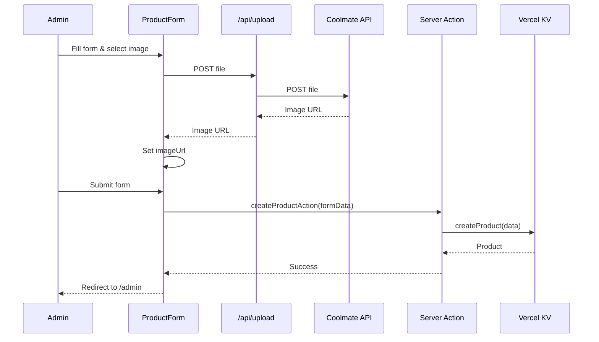
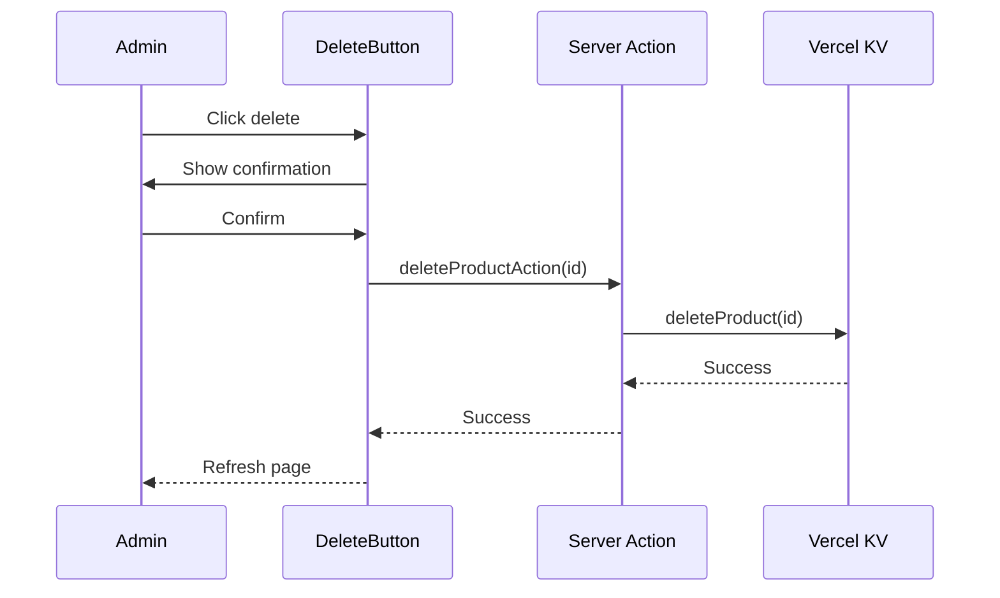

# Design Document

## Overview

Hệ thống quản lý sản phẩm e-commerce chuyên về đồ khô (cá khô) được xây dựng trên Next.js 14+ với App Router, sử dụng React Server Components và Server Actions. Dữ liệu được lưu trữ trên Vercel KV (Redis), hình ảnh được upload qua Coolmate Media API. Ứng dụng bao gồm 3 phần chính:

1. **Public Pages**: Product Listing và Product Detail - thiết kế phù hợp với sản phẩm thực phẩm khô
2. **Admin Panel**: CRUD operations cho sản phẩm
3. **API Routes**: Upload handler và data operations

## Architecture

### Technology Stack

- **Framework**: Next.js 14+ (App Router)
- **Language**: TypeScript
- **Styling**: Tailwind CSS
- **Database**: Vercel KV (@vercel/kv)
- **Image Upload**: Coolmate Media API
- **File Parsing**: formidable
- **Deployment**: Vercel

### Project Structure

```
/
├── app/
│   ├── page.tsx                    # Product listing page
│   ├── products/
│   │   └── [id]/
│   │       └── page.tsx            # Product detail page
│   ├── admin/
│   │   ├── page.tsx                # Admin dashboard (product list)
│   │   ├── products/
│   │   │   ├── new/
│   │   │   │   └── page.tsx        # Create product form
│   │   │   └── [id]/
│   │   │       └── edit/
│   │   │           └── page.tsx    # Edit product form
│   │   └── layout.tsx              # Admin layout
│   ├── api/
│   │   └── upload/
│   │       └── route.ts            # Image upload API
│   └── layout.tsx                  # Root layout
├── lib/
│   ├── db.ts                       # Vercel KV client and operations
│   ├── types.ts                    # TypeScript types
│   └── actions.ts                  # Server actions for CRUD
├── components/
│   ├── ProductCard.tsx             # Product card component
│   ├── ProductForm.tsx             # Product form component
│   ├── ImageUpload.tsx             # Image upload component
│   └── DeleteButton.tsx            # Delete confirmation button
├── public/
├── .env.local                      # Environment variables
├── next.config.js
├── tailwind.config.js
├── tsconfig.json
└── package.json
```

## Components and Interfaces

### Data Models

#### Product Type

```typescript
interface Product {
  id: string;                    // UUID
  title: string;                 // e.g., "Cá Lóc Khô 500g"
  description: string;           // Mô tả chi tiết, cách chế biến, bảo quản
  originalPrice: number;         // Giá gốc
  salePrice: number;             // Giá bán
  imageUrl: string;              // URL from Coolmate Media
  createdAt: number;             // Timestamp
  updatedAt: number;             // Timestamp
}
```

#### Form Data Type

```typescript
interface ProductFormData {
  title: string;
  description: string;
  originalPrice: string;         // String for form input
  salePrice: string;             // String for form input
  imageUrl: string;
}
```

### Database Operations (lib/db.ts)

```typescript
// Vercel KV key patterns:
// - products:list -> Set of product IDs
// - product:{id} -> Product object

export async function getAllProducts(): Promise<Product[]>
export async function getProductById(id: string): Promise<Product | null>
export async function createProduct(data: Omit<Product, 'id' | 'createdAt' | 'updatedAt'>): Promise<Product>
export async function updateProduct(id: string, data: Partial<Product>): Promise<Product | null>
export async function deleteProduct(id: string): Promise<boolean>
```

### Server Actions (lib/actions.ts)

```typescript
'use server'

export async function createProductAction(formData: FormData): Promise<{ success: boolean; error?: string; productId?: string }>
export async function updateProductAction(id: string, formData: FormData): Promise<{ success: boolean; error?: string }>
export async function deleteProductAction(id: string): Promise<{ success: boolean; error?: string }>
```

### API Routes

#### POST /api/upload

Upload image to Coolmate Media API using formidable.

**Request**: multipart/form-data with file field
**Response**: 
```typescript
{
  success: boolean;
  url?: string;      // Coolmate Media URL
  error?: string;
}
```

**Implementation Flow**:
1. Parse multipart form data using formidable
2. Validate file exists and type
3. Create FormData and append file stream
4. POST to https://media.coolmate.me/api/upload
5. Extract image URL from response
6. Return formatted URL

## User Interface Design

### Public Pages

#### Product Listing Page (/)

**Layout**:
- Header with site branding (e.g., "Cá Khô Đặc Sản")
- Hero section (optional): Banner image hoặc tagline về sản phẩm cá khô
- Grid layout (responsive: 1 col mobile, 2 cols tablet, 3-4 cols desktop)
- Each product card shows:
  - Image (aspect ratio 4:3 hoặc 1:1, hiển thị rõ sản phẩm cá khô)
  - Product name (e.g., "Cá Lóc Khô", "Cá Sặc Khô")
  - Weight/Size indicator (e.g., "500g", "1kg") - nếu có trong title
  - Original price (strikethrough, màu xám)
  - Sale price (màu đỏ/cam nổi bật, font lớn)
  - Discount badge nếu có (e.g., "-20%")
  - Hover effect: slight scale up và shadow
  - Click to navigate to detail

**Styling for Food Products**:
- Clean, appetizing color scheme (warm tones: vàng, cam, nâu)
- High-quality product images with white/light background
- Clear typography for prices
- Trust indicators (e.g., "Tươi ngon", "Đảm bảo chất lượng")

**Loading State**: Skeleton cards với shimmer effect

**Empty State**: "Chưa có sản phẩm nào. Vui lòng quay lại sau!"

#### Product Detail Page (/products/[id])

**Layout**:
- Breadcrumb navigation (Trang chủ > Sản phẩm > [Tên sản phẩm])
- Two-column layout (image left, info right on desktop, stacked on mobile)
- **Left Column**:
  - Large product image (zoomable on hover/click)
  - Image should clearly show the dried fish product
- **Right Column**:
  - Product name (h1, prominent)
  - Price section:
    - Original price (strikethrough, smaller, gray)
    - Sale price (large, bold, red/orange color)
    - Savings amount (e.g., "Tiết kiệm 50.000đ")
  - Product highlights (bullet points):
    - Origin (e.g., "Nguồn gốc: Cà Mau")
    - Quality (e.g., "Cá tươi, sấy khô tự nhiên")
    - Weight/Size
  - Description section:
    - Detailed description about the product
    - Preparation/cooking instructions
    - Storage instructions
  - Call-to-action section:
    - Contact button (Zalo, Phone)
    - Or "Đặt hàng ngay" button
- **Additional Sections** (below main content):
  - Product specifications table
  - Customer reviews (future)
  - Related products (future)

**Styling for Food Detail**:
- Appetizing color palette
- Clear, readable fonts
- Emphasis on product quality and freshness
- Trust signals (certifications, guarantees)

**Error State**: 404 page với message "Không tìm thấy sản phẩm" và link về trang chủ

### Admin Pages

#### Admin Dashboard (/admin)

**Layout**:
- Header with "Quản lý sản phẩm" title
- "Thêm sản phẩm mới" button (navigate to /admin/products/new)
- Table of products:
  - Thumbnail
  - Title
  - Prices
  - Actions (Edit, Delete)

**Delete Confirmation**: Modal or confirm dialog

#### Create Product Page (/admin/products/new)

**Form Fields**:
- Image upload (with preview)
- Title (text input, required)
- Original price (number input, required)
- Sale price (number input, required)
- Description (textarea, required)
- Submit button
- Cancel button

**Validation**:
- All fields required
- Sale price <= Original price
- Image must be uploaded

#### Edit Product Page (/admin/products/[id]/edit)

Same as create form but pre-populated with existing data.

### Component Design

#### ProductCard Component

```typescript
interface ProductCardProps {
  product: Product;
  href: string;
}
```

Displays product in card format with image, title, and prices.

#### ProductForm Component

```typescript
interface ProductFormProps {
  product?: Product;              // Undefined for create, defined for edit
  onSubmit: (formData: FormData) => Promise<void>;
}
```

Reusable form for create/edit with client-side validation.

#### ImageUpload Component

```typescript
interface ImageUploadProps {
  value?: string;                 // Current image URL
  onChange: (url: string) => void;
}
```

Handles file selection, upload to API, and preview display.

#### DeleteButton Component

```typescript
interface DeleteButtonProps {
  productId: string;
  onDelete: () => Promise<void>;
}
```

Button with confirmation dialog for delete action.

## Data Flow

### Product Listing Flow



### Product Detail Flow



### Create Product Flow



### Update Product Flow

Similar to create, but uses updateProductAction and pre-populates form.

### Delete Product Flow



## Error Handling

### Client-Side Errors

1. **Form Validation**: Display inline error messages for invalid inputs
2. **Upload Failures**: Show error toast/message if image upload fails
3. **Network Errors**: Display user-friendly error messages with retry option

### Server-Side Errors

1. **Database Errors**: Log error, return generic error message to client
2. **Upload API Errors**: Log Coolmate API response, return error to client
3. **Not Found**: Return 404 page for invalid product IDs
4. **Validation Errors**: Return specific error messages for invalid data

### Error Response Format

```typescript
{
  success: false;
  error: string;  // User-friendly error message
}
```

## Testing Strategy

### Unit Tests

- Database operations (lib/db.ts)
- Server actions validation logic
- Component rendering with different props

### Integration Tests

- Complete CRUD flows
- Image upload flow
- Form submission and validation

### Manual Testing Checklist

- [ ] Product listing displays correctly
- [ ] Product detail shows all information
- [ ] Create product with image upload works
- [ ] Edit product updates data correctly
- [ ] Delete product removes from list
- [ ] Form validation prevents invalid submissions
- [ ] Loading states display properly
- [ ] Error states display properly
- [ ] Responsive design works on mobile/tablet/desktop
- [ ] Deploy to Vercel successfully
- [ ] Vercel KV connection works in production

## Environment Configuration

### Required Environment Variables

```env
# Vercel KV (automatically set by Vercel)
KV_URL=
KV_REST_API_URL=
KV_REST_API_TOKEN=
KV_REST_API_READ_ONLY_TOKEN=
```

### Vercel Configuration

**vercel.json** (optional, Next.js auto-configures):
```json
{
  "buildCommand": "next build",
  "framework": "nextjs"
}
```

**next.config.js**:
```javascript
module.exports = {
  images: {
    domains: ['media.coolmate.me'],
  },
}
```

## Performance Considerations

1. **Image Optimization**: Use Next.js Image component with Coolmate Media URLs
2. **Caching**: Leverage Vercel KV caching capabilities
3. **Server Components**: Use RSC for data fetching to reduce client bundle
4. **Lazy Loading**: Implement pagination if product list grows large
5. **Optimistic Updates**: Show immediate feedback on admin actions

## Security Considerations

1. **Admin Authentication**: Add authentication middleware for /admin routes (future enhancement)
2. **Input Validation**: Validate all form inputs on server-side
3. **File Upload**: Validate file types and sizes before uploading
4. **CORS**: Configure CORS headers for upload API
5. **Environment Variables**: Never expose KV credentials to client

## Deployment Steps

1. Create Vercel project
2. Connect GitHub repository
3. Add Vercel KV storage to project
4. Environment variables auto-configured by Vercel
5. Deploy
6. Verify KV connection and CRUD operations

## Future Enhancements

- Admin authentication and authorization
- Product categories and filtering
- Search functionality
- Pagination for product listing
- Image gallery (multiple images per product)
- Product variants (sizes, colors)
- Inventory management
- Order management system
